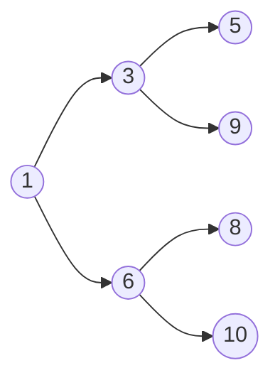
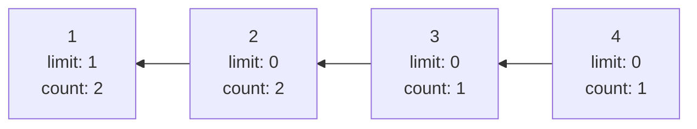
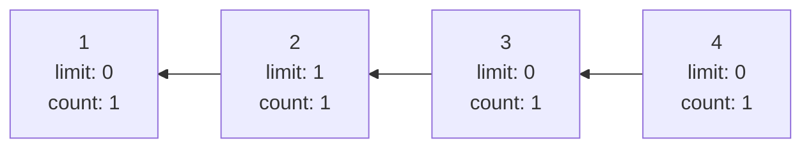
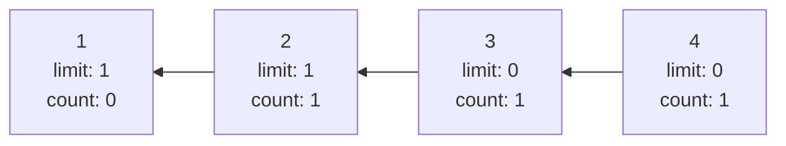
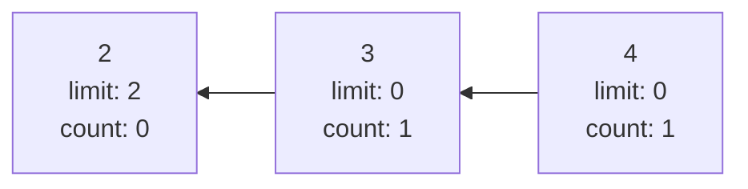
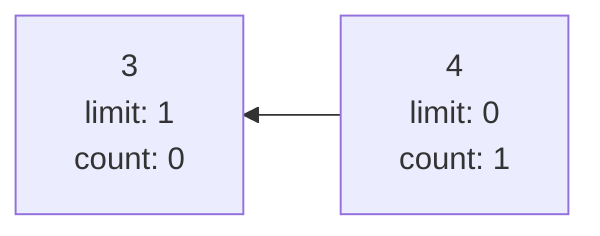
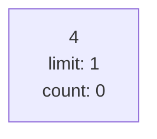

# Custom Priority Queue with Throttle rate


The repository contains solutions for the Generic Priority Queue with Throttle rate.

## Principles of operation
The Custom Priority queue is a Priority Queue with a Throttle rate.
The throttle rate limits the number of the same elements dequeued in a row (not necessary consequently) and allows higher priority items to be dequeued next.

#### Features 
- Generic (see template requirements below)
- Thread Safe
- Configurable: You can configure capacity or throttle rate
- Optimized (see time and complexities below)

## Interface

The class supports public methods:

| Method| Description| Input | Output |
|----------------|-------------------------------|-----------------------------|-----------------------------|
|void **Enqueue**(T element)| Enqueues new element in Priority Queue| New element |    None                   |
|T **Dequeue**()     | Dequeue new element from the Priority Queue| Dequeued element |    None
|size_t **Size**()    |Returns number of elements |    None|    number of elements
|bool **IsEmpty**()     |Returns if queue is empty |    None|    True if Queue is empty, False otherwise
|	**PriorityQueue**(PriorityQueue&&)     |Copy Constructor |    None|    Other element
|	**PriorityQueue**(PriorityQueue&)     |Move Constructor |    None|    Other element
|	PriorityQueue& **operator=**(const PriorityQueue& other)    |Copy Assignment|    None|    Other element
|	PriorityQueue& **operator=**(const PriorityQueue&& other)    |Move Assignment|    None|    Other element
|void **operator+=**(T element) | Enqueues new element in Priority Queue| New element |    None   

## Example Use Case
```cpp

#include <iostream>
#include "PriorityQueue.h"

using namespace std;

int main() {

	PriorityQueue<int> q;
	q.Enqueue(4);
	q.Enqueue(1);
	q.Enqueue(3);
	q.Enqueue(2);
	q.Enqueue(1);
	q.Enqueue(2);
	cout << q.Dequeue()<< endl; // 1
	q.Enqueue(1);
	cout << q.Dequeue()<< endl; // 1
	cout << q.Dequeue()<< endl; // 2
	cout << q.Dequeue()<< endl; // 1
	cout << q.Dequeue()<< endl; // 2
	return 0;
}

```
## Algorithm

In order to find an optimized solution several data structures are utilized in the solution.
Each value is wrapped under the node which allows optimization in performance.

Note that node  data units allows to group the same elements (do not repeat and save the count of each element and save the number of times it is used in order to track throttle rate)
#### Node Structure

|  Name| Type  |Description  |
|--|--|--|
| **Value** | T  | Value of the element
| **Count** | int| Number of such elements
| **Limit** | int  | Current throttle rate limit number (how many times it was already dequeued without lower priority)


#### Data Structure

##### Priority Queue (Heap)

The min heap implementation is utilized to store noted in standard Priority Queue. 
Heap will allow to Deque from standard queue/enqueue in **O(log(n))** operation.

|  1 | 6  | 3  |10   | 8 | 9 | 5
|---|---|---|---|---|---|---|





##### Note
Assumption: Actual Priority queue could be utilized from STL but since the solution is built from basics, the Heap implementation of the queue is utilized, this allows to have better control in concurrency as well. But the STL Priority queue could also be used for a simpler solution.

### Fast Addressing Already Existing Nodes

Since the same values are saved in the same node, in orderr to find the node in **O(1)** operation, the hashmap (unordered map) is utilized.

It maps value ->  to the node

#### Operation

```
  *     PSEUDOCODE 
  * 
  1     Dequeue elements from the  heap
  2     WHILE Element has the  limit reachthrottlee rate
  3        Keep in temp stack and move to the  next element
  4     END WHILE
  5     Push back all elements in temp stack/array. 
  6            Only remove if the count and limitboth reachedd 0 
  7    RETURN Element
  *
  *
  *
  1     Enqueue
  2     If a  element exists in themap fasttaddressingg) increase count.
  3     Enqueue element in the heap (add at the top and sink)
  4     Notify if needed thethread thato waits ofan  empty queue
 
  ```
Since the elements may add during the runtime, the elements are kept even count = 0, until both count and limit becomes 0. That is the reason the allocated array needs to be CAPACITY*THROTTLE_RATE.

### Example

Enqueue: 4, 1, 3, 2, 1, 2, 1

This would result in:


Dequeue: 1


Dequeue: 1


Dequeue: 2

Note that the limit of 1 was reset.

Dequeue: 1


Note that 1 is still kept since limit is not 0.

Dequeue: 2



Dequeue: 3



Dequeue: 4



## Template
The provided Priority Queue is a template, which means it can hold generic types.
However there are minimum requirements for the type:

Type should implement:

- == (equals) operator
- < (less) operator
- Be hashable or define hash function from map

## Performance Metrics

#### Correctness
Please see below the test coverage section
####  Simplicity
While the solution is may involve complex data structures, the data structures are utilized to reach higher efficiency. The heap implementation may be substituted with STL Priority queue implementation or separated heap implementation. However given the efficiency and simple abstraction for the user by public function, the class allows being used easier for the user.

Note that additionally, the class supports +=, copy/move semantics for better usability and interface.

#### Reusability
The class is a template class that allows flexibility in:
- Type (the requirements are kept minimum (only ==, <  and hash operation)
- Capacity
- Throttle rate


### Efficiency
#### Time
Enqueue and Dequeue both cases would be in **log(N)** operation;
Best case scenario (when the element exists) **O(1)** operation
Worst case scenario (when all elements have limit reached before) **N*log(n)**  operation

#### Space
Space complexity is **O(CAPACITY*T)** since the nodes are kept for the limits. Where T is the throttle rate.

## Thread Safety

For multi-threading, one lock/mutex and two condition variables are used. Several test cases for multithreading testing are included in unit tests.
The queue is blocked if it is empty and the user tries to dequeue.
The queue is blocked if it reached capacity and the user tries to enqueue.

## Verification
The test case coverage includes:

- TEST_METHOD(TestBasic1) : Provided test case 1
- TEST_METHOD(TestBasic2) : Provided test case 2
- TEST_METHOD(TestBasic3) : Test case when there is no lower priority item
- TEST_METHOD(TestThread1) : Test case with multiple threads encoding together
- TEST_METHOD(TestThread2) : Test case with multiple threads 
- TEST_METHOD(TestThreadFull) : Test case when it reaching full capacity and need to be blocked
- TEST_METHOD(TestThreadEmpty) : Test case when it is empty and need to be blocked
- TEST_METHOD(TestThreadEmpty2): Test case when it is empty (there is still element but Throttle rater limits and need to be blocked
- TEST_METHOD(TestThrottleRate1): Different Throttle Rate
- TEST_METHOD(TestThrottleRate2): Different Throttle Rate2
- TEST_METHOD(TestStrings): Mixed with Strings (alphabetic ordering)
- TEST_METHOD(TestMixedType): Mixed with custom class/structure

### Lower Priority Elements Problem

TestBasic3 includes a case  when x+1 priority is not available (eg after 2 we don't have 3, or after 4 we don't have 5, 6, 7. In such case, instead of x+1, the >=x+1 priority is taken for the next. The allows the queue not to be blocked.
```cpp
	int input[] = { 1, 2, 2, 4, 4, 8, 8, 8, 9, 1, 1, 1 };
	int output[] = { 1, 1, 2, 1, 1, 2,  4, 4, 8, 8, 9, 8 };
```

## System Requirements
The solution can be distributed in under PriorityQueue.h template file.
The >=c++11 is required.

The solution was developed using Visual Studio 2022, the solution project is available with Unit testing, however the files may be imported in other IDE.

## Contact
Please open the issue in case of any improvement, or questions.

